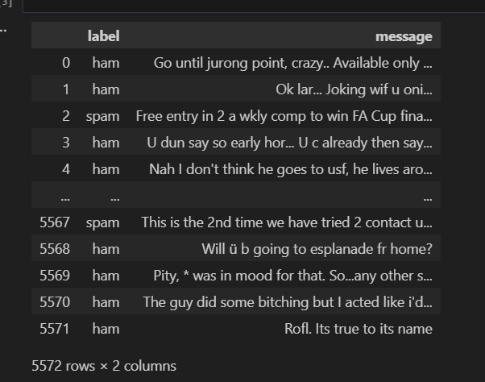

# Spam-Ham-using-BoW-TFIDF

Email classification as Spam or HAM (not spam) using NLP techniques for converting text into vectors like Bag of words(BoW) and Term Frequency-Inverse Document Frequency(TF-IDF).

Dataset:

